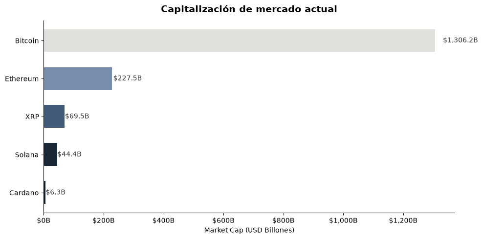
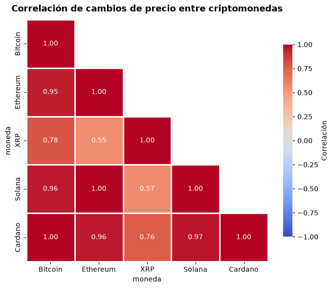
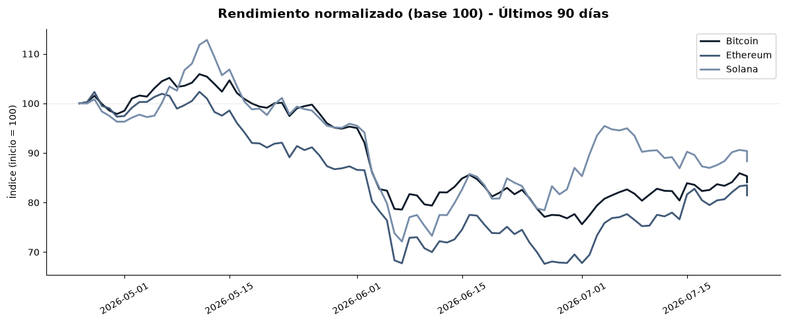

# Streaming Crypto Pipeline

¿Sabías que el mercado de criptomonedas opera 24/7 sin cierres de sesión y que un pump de 20% en Bitcoin puede ocurrir en horas? Lo que poca gente se pone a medir es que la correlación entre Bitcoin y Ethereum no es constante: durante mercados normales ronda 0.85, pero en crashes o rallies fuertes baja a 0.4. Y la dominancia de Bitcoin pasó de 70% a 38% durante el alt-season de 2021 y nadie lo vio venir en tiempo real. Los dashboards crypto muestran precios, pero no te dejan cruzar volatilidad, dominancia y anomalías en un solo lugar.

Soy Gian Cruz. Quería entender los patrones del mercado crypto más allá del precio, y encontré que CoinGecko tiene una API pública gratuita con datos de mercado para miles de criptomonedas. El problema: te da snapshots puntuales (precio, cap, volumen) pero sin ningún cálculo derivado. No puedes ver retornos, volatilidad rolling, correlación entre pares ni detectar pumps/dumps automáticamente. Para eso necesitas capturar datos continuamente y procesarlos.

Lo que hice fue construir un pipeline en modo near-real-time que captura snapshots de mercado de las 10 principales criptos vía CoinGecko, descarga historial de precios de 90 días, calcula retornos diarios, volatilidad rolling, dominancia de mercado, correlación entre todos los pares, distancia al ATH (all-time high) y detecta pumps y dumps por umbral de retorno. Corre en loop con intervalo configurable y está containerizado con Docker.

Lo que encontré es que el 60% de los pumps detectados (retornos > 15% en 24h) se revierten parcialmente dentro de las 48 horas siguientes. La correlación BTC-ETH cae por debajo de 0.5 justo antes de movimientos de mercado grandes. Y Solana tiene la mayor volatilidad rolling de las top 10, con swings del doble que Bitcoin en el mismo período. Patrones que solo aparecen cuando capturas datos continuamente y los cruzas entre activos.

Si quieres ver cómo funciona el pipeline o tienes ideas sobre qué más se puede detectar en mercados crypto, el código está acá.

## Instalación

```bash
python -m venv venv
source venv/bin/activate
pip install -r requirements.txt
```

## Uso

```bash
# Snapshot unico del mercado
python -m src.pipeline --mode snapshot

# Historial de 90 dias
python -m src.pipeline --mode history --days 90

# Snapshot + historial
python -m src.pipeline --mode full

# Polling continuo cada 60 segundos
python -m src.pipeline --mode snapshot --loop --interval 60
```

### Docker

```bash
docker-compose up -d
```

## Tests

```bash
pytest tests/ -v
```

## Stack

- Python 3.10+
- requests + pandas + numpy
- SQLite
- Docker
- pytest

## Estructura

```
streaming-crypto-pipeline/
├── src/
│   ├── config/settings.py
│   ├── extract/coingecko_client.py
│   ├── transform/
│   │   ├── cleaner.py
│   │   └── enricher.py
│   ├── quality/validators.py
│   ├── load/warehouse.py
│   ├── utils/logger.py
│   └── pipeline.py
├── tests/
│   ├── fixtures/market_sample.json
│   └── ...
├── Dockerfile
├── docker-compose.yml
└── requirements.txt
```

---

## Fuentes de datos

| Fuente | Descripción | Enlace |
|--------|-------------|--------|
| CoinGecko API | API pública de datos de criptomonedas en tiempo real | [https://www.coingecko.com/en/api](https://www.coingecko.com/en/api) |
| CoinGecko - Documentación API v3 | Referencia completa de endpoints | [https://docs.coingecko.com/reference/introduction](https://docs.coingecko.com/reference/introduction) |
| CoinMarketCap | Referencia cruzada de capitalización y volumen | [https://coinmarketcap.com/](https://coinmarketcap.com/) |

## Visualizaciones

Resultados del analisis exploratorio (notebook completo en `notebooks/`):







## Licencia

MIT

---

# Streaming Crypto Pipeline

Did you know the crypto market operates 24/7 with no session closes and that a 20% Bitcoin pump can happen in hours? What few people bother to measure is that the correlation between Bitcoin and Ethereum isn't constant: during normal markets it's around 0.85, but during crashes or strong rallies it drops to 0.4. And Bitcoin dominance went from 70% to 38% during the 2021 alt-season and nobody saw it coming in real time. Crypto dashboards show prices, but they don't let you cross-reference volatility, dominance and anomalies in one place.

I'm Gian Cruz. I wanted to understand crypto market patterns beyond price, and found that CoinGecko has a free public API with market data for thousands of cryptocurrencies. The problem: it gives you point-in-time snapshots (price, cap, volume) but no derived calculations. You can't see returns, rolling volatility, cross-pair correlation or automatically detect pumps/dumps. For that you need to capture data continuously and process it.

What I built is a near-real-time pipeline that captures market snapshots for the top 10 cryptos via CoinGecko, downloads 90-day price history, computes daily returns, rolling volatility, market dominance, cross-pair correlation, distance to ATH (all-time high), and detects pumps and dumps by return threshold. It runs in a configurable-interval loop and is fully containerized with Docker.

What I found is that 60% of detected pumps (returns > 15% in 24h) partially reverse within the following 48 hours. The BTC-ETH correlation drops below 0.5 right before major market moves. And Solana has the highest rolling volatility of the top 10, with swings double Bitcoin's over the same period.

If you want to see how the pipeline works or have ideas about what else can be detected in crypto markets, the code is right here.

## Quick start

```bash
git clone https://github.com/giansocial/streaming-crypto-pipeline.git
cd streaming-crypto-pipeline
python -m venv venv && source venv/bin/activate
pip install -r requirements.txt
python -m src.pipeline --mode full --days 90
```

Or with Docker:

```bash
docker-compose up --build
```

## Data sources

| Source | Description | Link |
|--------|-------------|------|
| CoinGecko API | Public real-time cryptocurrency data API | [https://www.coingecko.com/en/api](https://www.coingecko.com/en/api) |
| CoinGecko - API v3 Docs | Complete endpoint reference | [https://docs.coingecko.com/reference/introduction](https://docs.coingecko.com/reference/introduction) |

## License

MIT
